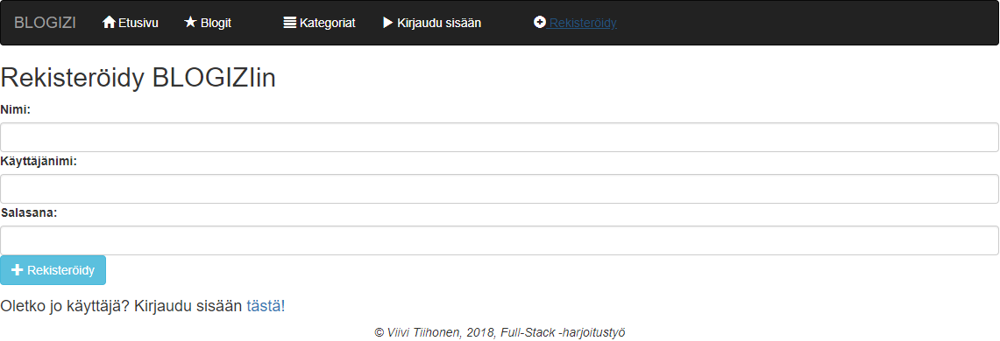
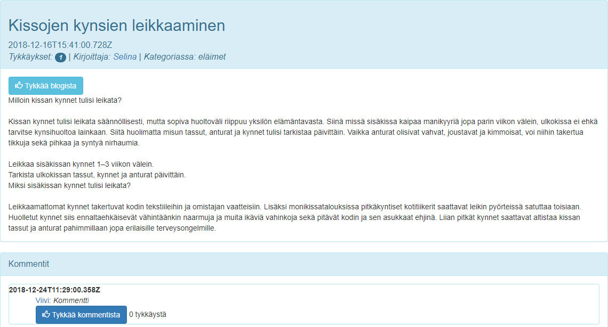
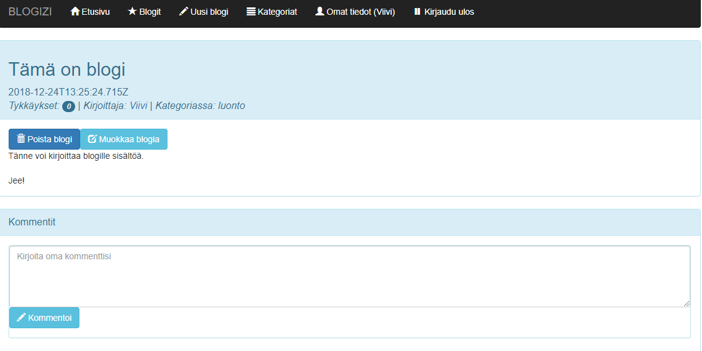
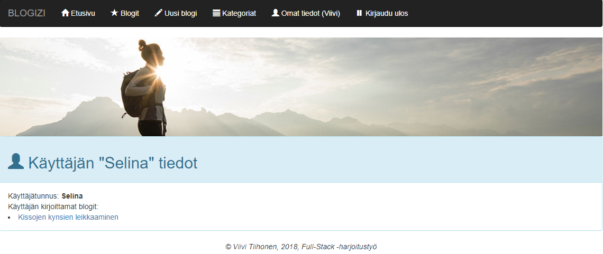

# Blogisovelluksen käyttöohjeet

Sovellus löytyy osoitteesta https://blogizi.herokuapp.com

## Tervetuloa BLOGIZIin!
Blogizi on sovellus, jossa rekisteröitymättömät käyttäjät voivat selailla muiden blogeja ja rekisteröityneet käyttäjät kirjoittaa blogeja, sekä antaa tykkäyksiä ja kommentteja muiden käyttäjien kirjoittamille blogeille.

## Rekisteröityminen
Sovellukseen voidaan rekisteröityä navigaatiopalkista löytyvän *Rekisteröidy* -napin kautta. Rekisteröitymiseen vaaditaan nimi, käyttäjänimi sekä salasana. Rekisteröitymisen onnistuttua ohjataan käyttäjä suoraan kirjautumissivulle.

## Kirjautuminen
Rekisteröitynyt käyttäjä pääsee kirjautumaan sovellukseen navigaatiopalkista löytyvät *Kirjaudu* -napin kautta. Kirjautumiseen syötetään käyttäjätunnus sekä siihen kohdistuva salasana. Kirjautumisen onnistuessa ohjataan kirjautunyt käyttäjä sovelluksen etusivulle.

## Blogilistaus
Kuten kirjautumatonkin käyttäjä, myös kirjautunut käyttäjä näkee navigaatiopalkista löytyvältä *Blogit* -välilehdeltä kirjoitetut blogit. Blogeja voidaan järjestää joko suosion (tykkäysten), kirjoitusajankohdan tai alkukirjainten mukaan. Blogeja voidaan myös etsiä tarkalla sanahaulla, joka suodattaa blogilistaan näkyviksi ainoastaan sellaiset blogit, joista löytyy hakukenttään syötetty sana. 

## Blogien kirjoittaminen
Kirjautunut käyttäjä näkee navigaatiopalkissa *Uusi blogi* -nappulan, joka johtaa bloginlisäyssivulle. Blogille täytyy antaa aihe, sekä sisältöä. Blogille tulee valita myös sille sopiva kategoria valmiista kategorialistasta. 

## Yksittäiset blogit
Toisen käyttäjän kirjoittaman blogin näkymästä löytyy blogitekstin sekä muiden blogitietojen lisäksi tykkäysnappula sekä kommenttikenttä.

Itse kirjoitetun blogin näkymästä löytyy blogitekstin sekä muiden blogitietojen lisäksi napit blogin muokkaamiseen ja poistamiseen sekä kommenttikenttä.

## Blogin muokkaaminen
Käyttäjän omia blogeja voi muokata. Blogin otsikkoa ei voi muokata, mutta blogin sisältöä saa muuttaa vapaasti. 

## Käyttäjätiedot
Navigaatiopalkista löytyvän *Omat tiedot (käyttäjänimi)* -napin takaa löytyy kirjautuneen käyttäjän tiedot sekä kirjoittamat blogit. 

 

Toisen käyttäjän kirjoittamasta blogista pääsee kyseisen käyttäjän tietoihin klikkaamalla kirjoittaja-linkkiä.

## Uloskirjautuminen
Sovelluksesta pääsee kirjautumaan ulos jo tutuksi tulleen navigaatiopalkin kautta. *Kirjaudu ulos* -nappi tuo käyttäjän sivulle, jossa vielä varmistetaan uloskirjautuminen.

